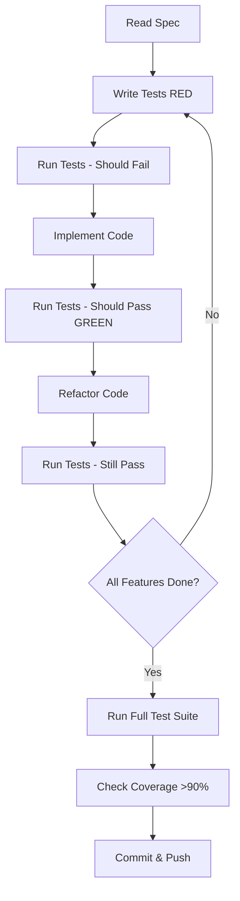

# Quick Start Guide - Step 1 Development

**Feature**: Core Todo Features (In-Memory Console App)
**Date**: 2025-12-31
**Audience**: Developers implementing Step 1

## Overview

This guide walks you through setting up your development environment and implementing the Step 1 console todo application following spec-driven development principles.

---

## Prerequisites

### System Requirements

- **Operating System**:
  - Linux (Ubuntu 22.04+ recommended)
  - macOS (13+ recommended)
  - Windows (WSL 2 with Ubuntu 22.04+ **REQUIRED**)

- **Python**: 3.13 or higher
- **UV**: Latest version (package manager)
- **Git**: For version control
- **Terminal**: UTF-8 support required

### Windows Users - WSL 2 Setup

```bash
# Install WSL 2 (run in PowerShell as Administrator)
wsl --install

# Set WSL 2 as default
wsl --set-default-version 2

# Install Ubuntu
wsl --install -d Ubuntu-22.04

# Launch Ubuntu and complete setup
# Then run all remaining commands inside WSL
```

---

## Step 1: Environment Setup

### Install UV (Python Package Manager)

```bash
# Linux/macOS/WSL
curl -LsSf https://astral.sh/uv/install.sh | sh

# Verify installation
uv --version
```

### Verify Python Version

```bash
# Check Python version
python3 --version  # Should be 3.13+

# If not installed, use UV to install Python 3.13
uv python install 3.13
```

---

## Step 2: Project Initialization

### Clone Repository (if not already)

```bash
cd /path/to/your/workspace
git clone <your-repo-url> hackathon-todo
cd hackathon-todo
```

### Initialize Python Project with UV

```bash
# Initialize project (if not already done)
uv init --name hackathon-todo --python 3.13

# This creates:
# - pyproject.toml (project configuration)
# - .python-version (specifies Python 3.13)
```

### Install Development Dependencies

```bash
# Install pytest and coverage tools
uv add --dev pytest pytest-cov

# Sync environment
uv sync
```

---

## Step 3: Project Structure Setup

### Create Directory Structure

```bash
# Create source directory
mkdir -p src/hackathon_todo

# Create test directory
mkdir -p tests

# Create design artifacts directory (if not exists)
mkdir -p specs/001-step-1-core-features/design
mkdir -p specs/001-step-1-core-features/contracts
```

### Verify Structure

```bash
tree -L 3 -I '__pycache__|.git|.pytest_cache'
```

Expected output:
```
hackathon-todo/
├── .specify/
│   ├── memory/
│   │   └── constitution.md
│   └── templates/
├── specs/
│   └── 001-step-1-core-features/
│       ├── spec.md
│       ├── plan.md
│       ├── design/
│       └── contracts/
├── src/
│   └── hackathon_todo/
│       └── __init__.py
├── tests/
├── pyproject.toml
├── README.md
└── CLAUDE.md
```

---

## Step 4: Implement Modules (Following TDD)

### Phase Order (Red-Green-Refactor)

1. **models.py** (Task dataclass)
2. **storage.py** (TaskStorage class)
3. **ui.py** (User interface functions)
4. **main.py** (Application entry point)

### TDD Workflow for Each Module

```bash
# 1. RED: Write failing tests first
uv run pytest tests/test_models.py -v
# Tests should FAIL (not yet implemented)

# 2. GREEN: Implement minimum code to pass tests
# Edit src/hackathon_todo/models.py

uv run pytest tests/test_models.py -v
# Tests should PASS

# 3. REFACTOR: Clean up code while keeping tests green
# Improve implementation

uv run pytest tests/test_models.py -v
# Tests should still PASS
```

### Module Implementation Order

#### 1. models.py - Task Dataclass

**Test file**: `tests/test_models.py`

```bash
# Create test file
touch tests/test_models.py

# Run tests (should fail - not implemented yet)
uv run pytest tests/test_models.py -v

# Implement models.py based on design/data-model.md
touch src/hackathon_todo/models.py

# Run tests again (should pass)
uv run pytest tests/test_models.py -v
```

#### 2. storage.py - TaskStorage Class

**Test file**: `tests/test_storage.py`

```bash
# Create test file
touch tests/test_storage.py

# Run tests (should fail)
uv run pytest tests/test_storage.py -v

# Implement storage.py
touch src/hackathon_todo/storage.py

# Run tests (should pass)
uv run pytest tests/test_storage.py -v
```

#### 3. ui.py - User Interface Functions

**Test file**: `tests/test_ui.py`

```bash
# Create test file
touch tests/test_ui.py

# Note: UI tests require mocking input() and print()
# See design/data-model.md for test examples

# Run tests
uv run pytest tests/test_ui.py -v

# Implement ui.py
touch src/hackathon_todo/ui.py

# Run tests
uv run pytest tests/test_ui.py -v
```

#### 4. main.py - Application Entry

**Test file**: `tests/test_integration.py`

```bash
# Create integration test
touch tests/test_integration.py

# Implement main.py
touch src/hackathon_todo/main.py

# Run integration tests
uv run pytest tests/test_integration.py -v
```

---

## Step 5: Running the Application

### Run Application

```bash
# Using UV
uv run python -m hackathon_todo.main

# Or make main.py executable
chmod +x src/hackathon_todo/main.py
uv run python src/hackathon_todo/main.py
```

### Expected Behavior

```
=== Todo Application ===
1. Add Task
2. View Tasks
3. Mark Task Complete
4. Update Task
5. Delete Task
6. Exit

Select an option (1-6):
```

---

## Step 6: Running Tests

### Run All Tests

```bash
# Run all tests
uv run pytest

# Run with verbose output
uv run pytest -v

# Run with coverage report
uv run pytest --cov=src/hackathon_todo --cov-report=term-missing

# Run specific test file
uv run pytest tests/test_models.py -v

# Run specific test function
uv run pytest tests/test_models.py::test_task_creation_with_valid_data -v
```

### Expected Coverage

Target: **>90% coverage** for all modules

```bash
# Generate HTML coverage report
uv run pytest --cov=src/hackathon_todo --cov-report=html

# Open coverage report
# Linux/WSL: xdg-open htmlcov/index.html
# macOS: open htmlcov/index.html
```

---

## Step 7: Code Quality Checks

### Run Linting (Optional but Recommended)

```bash
# Install linting tools
uv add --dev ruff

# Run linter
uv run ruff check src/ tests/

# Auto-fix issues
uv run ruff check --fix src/ tests/
```

### Verify Module Size

```bash
# Check lines per module (should be <300 per constitution)
wc -l src/hackathon_todo/*.py
```

---

## Step 8: Git Workflow

### Commit Changes

```bash
# Check status
git status

# Add changes
git add .

# Commit with conventional commit format
git commit -m "feat(step-1): implement core todo features

- Add Task dataclass with validation
- Implement TaskStorage with CRUD operations
- Create menu-driven UI with input validation
- Add comprehensive test suite with >90% coverage

Closes #1"

# Push to remote
git push origin 001-step-1-core-features
```

---

## Common Issues & Troubleshooting

### Issue: UV command not found

```bash
# Reinstall UV
curl -LsSf https://astral.sh/uv/install.sh | sh

# Add to PATH (add to ~/.bashrc or ~/.zshrc)
export PATH="$HOME/.cargo/bin:$PATH"

# Reload shell
source ~/.bashrc  # or source ~/.zshrc
```

### Issue: Python 3.13 not available

```bash
# Install Python 3.13 using UV
uv python install 3.13

# Set as project Python
uv python pin 3.13
```

### Issue: Tests fail with import errors

```bash
# Ensure __init__.py exists
touch src/hackathon_todo/__init__.py

# Install package in editable mode
uv pip install -e .

# Or run tests with UV
uv run pytest
```

### Issue: UTF-8 characters not displaying

```bash
# Set locale (Linux/WSL)
export LC_ALL=en_US.UTF-8
export LANG=en_US.UTF-8

# Add to ~/.bashrc for persistence
echo 'export LC_ALL=en_US.UTF-8' >> ~/.bashrc
```

---

## Development Workflow Summary



---

## Next Steps After Step 1

Once Step 1 is complete and all tests pass:

1. **Run final validation**:
   ```bash
   uv run pytest --cov=src/hackathon_todo --cov-report=term
   ```

2. **Create demo video** (under 90 seconds)

3. **Update README.md** with:
   - Project overview
   - Setup instructions
   - Usage examples
   - Feature list

4. **Submit via form**: https://forms.gle/KMKEKaFUD6ZX4UtY8

5. **Begin Step 2 specification**:
   - Update spec.md with Step 2 details
   - Plan database migration
   - Design REST API endpoints

---

## Reference Links

- **UV Documentation**: https://docs.astral.sh/uv/
- **pytest Documentation**: https://docs.pytest.org/
- **Python Dataclasses**: https://docs.python.org/3/library/dataclasses.html
- **Conventional Commits**: https://www.conventionalcommits.org/

---

## Support

For issues or questions:
- Review constitution: `.specify/memory/constitution.md`
- Check spec: `specs/001-step-1-core-features/spec.md`
- Review plan: `specs/001-step-1-core-features/plan.md`
- Consult Claude Code for implementation guidance
